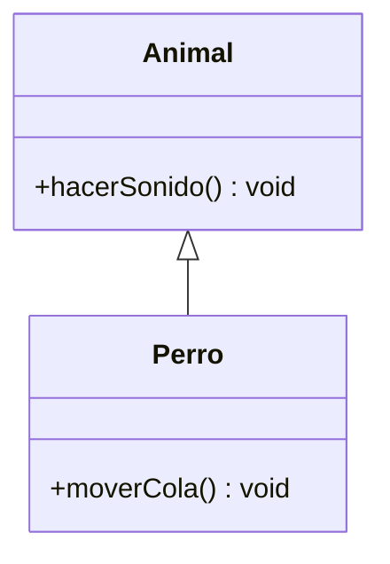

# Diagrama UML de herencia

## Código representado

El diagrama representa las clases `Animal` y `Perro` del archivo `java/Herencia.java`.

## Explicación

- **Animal:** es la clase padre y declara el método público `hacerSonido()`.
- **Perro:** es la clase hija y hereda de `Animal` mediante la palabra clave `extends`. También declara el método público `moverCola()`.
- **Relación:** la flecha de generalización tiene el triángulo vacío apuntando hacia `Animal`, que es la clase padre.

El signo `+` indica visibilidad pública en UML. Los métodos se representan con su nombre y tipo de retorno `void`.
